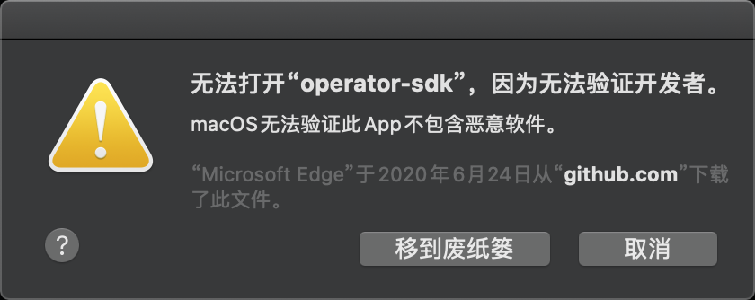
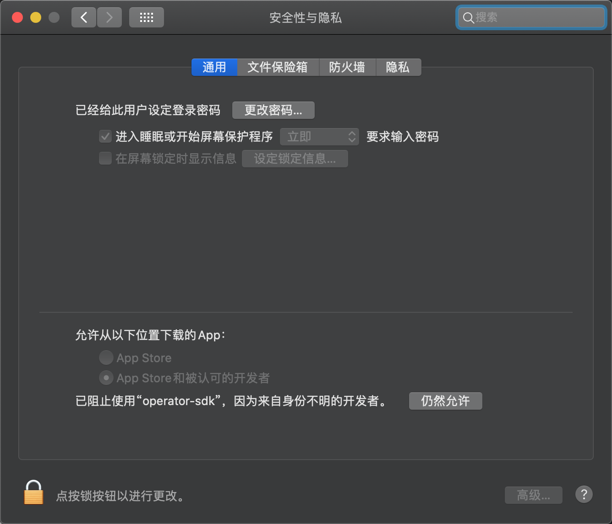
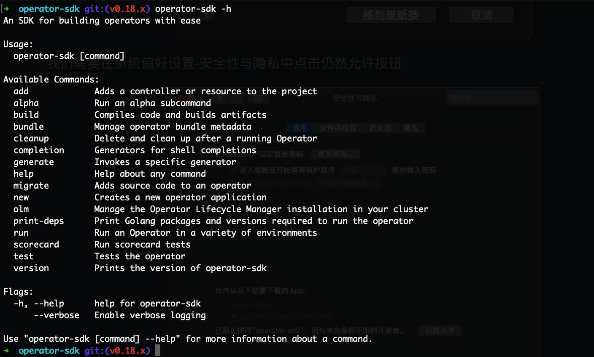
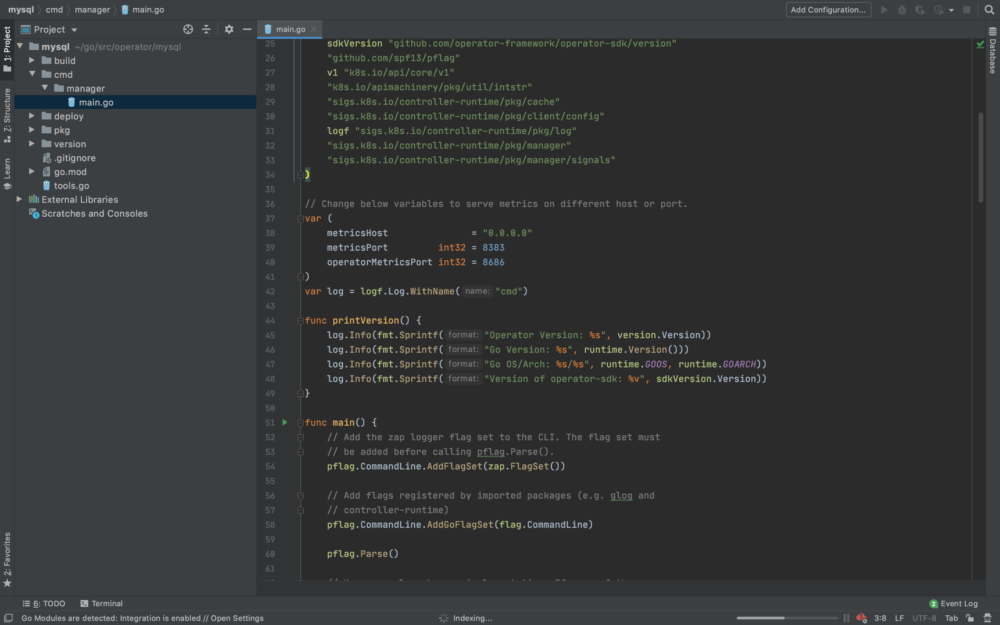
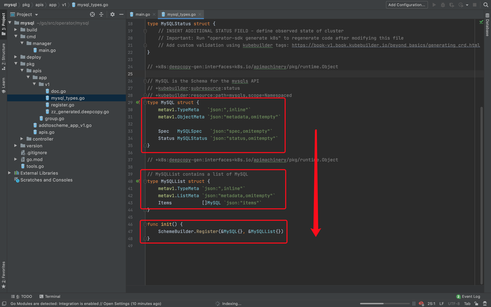
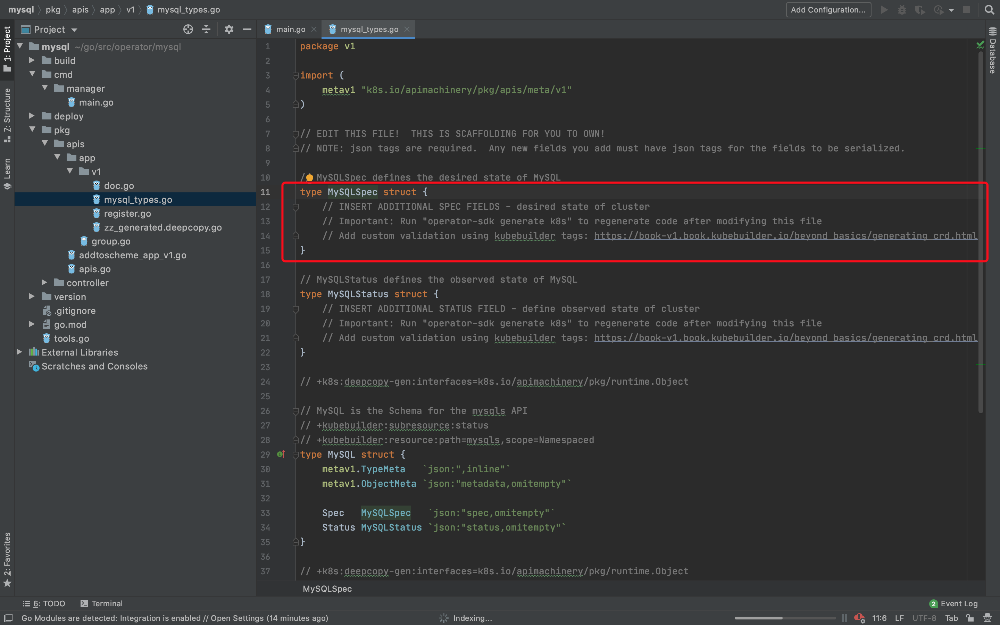
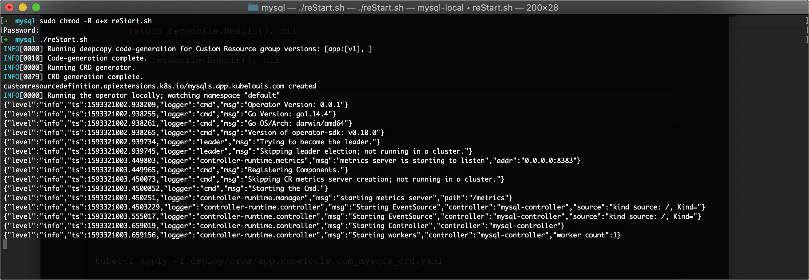
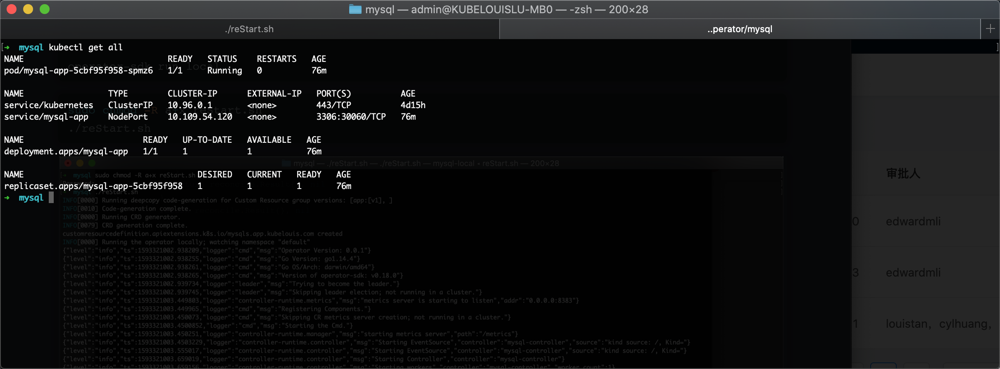
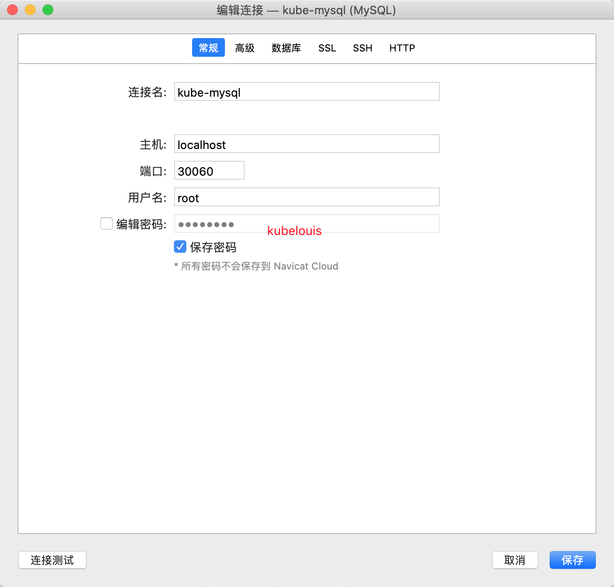
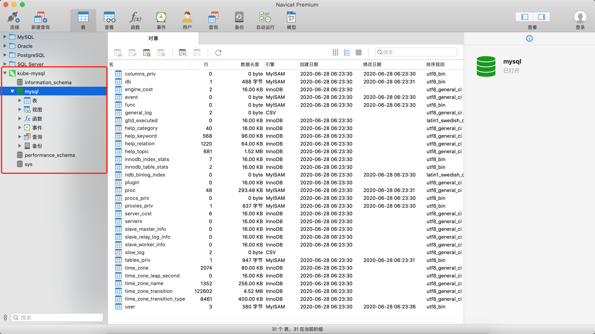

## Kubernetes Operator-SKD初实践分享

#### Operator-SDK简介🍺

Operator-SDK是Operator Framework的组件之一，主要用来编写Kubernetes的一些插件，让我们能够更方便地操作Kubernetes。

#### 实践期望🍻

在我们准备部署一个服务的时候，可能会考虑到诸多因素，例如最简单的一个Web应用也需要一个Deployment、一个Service，才能够满足我们的基本需求。抑或是你需要部署后端，涉及数据库，存储卷，再或者是期望Ingress，流量管控，那么部署起来就更复杂了，可能需要写很多YAML文件，即便你有相应的模版，也需要拿出一定的时间才能达到自己觉得满意的状态。

流程越多越容易出现失误，失误越多越耽误时间，时间耽误多了效率就降下来了。所以我们有时候可能会希望，如果有一个Kind，它就叫Nginx或者是MySQL、Redis等，自己输入相应的参数进去就能够达到自己的预期，那将会是一件非常美好的事情。

那么，如果你有这样的想法，Operator-SDK就可以帮助到你！

附：Operator-SDK官网链接：

[Operator-SDK]: https://sdk.operatorframework.io/


#### 环境清单罗列🧾

|      配置项      | 具体配置 |
| :--------------: | :------: |
|     操作系统     |  MacOS   |
|    Golang版本    |  1.14.4  |
|  Kubernetes版本  |  1.16.5  |
| Operator-SDK版本 |  v0.18   |

#### 环境部署🌲

###### Golang

略

###### Kubernetes

略

###### Operator-SDK

个人不建议用brew去安装，因为最终安装的版本会比较低。本次分享中我们采用编译源码的方式进行（还有更多方式可以参考官网文档）

```bash
git clone https://github.com/operator-framework/operator-sdk

cd operator-sdk

git checkout v0.18.x

make tidy

make install
```

###### 注意⚠️：

此处可能因为科学上网的原因，大家在make tidy的时候会卡住，此处推荐大家设置GOPROXY

```bash
export GO111MODULE=on

export GOPROXY=https://goproxy.cn
```

通过

```sh
go env|grep GOPROXY
```

查看设置情况


我们输入

```bash
operator-sdk -h
```

会弹出警告



我们需要在系统偏好设置-安全性与隐私中点击仍然允许按钮



到达这里之后意味着Operator-SDK的环境搭建完毕了



#### 预期目标🌟

```yaml
apiVersion: app.kubelouis.com/v1
kind: MySQL
metadata:
  name: mysql-app
spec:
  image: mysql:5.7
  replicas: 1
  rootPassword: kubelouis
  ports:
    - port: 3306
      targetPort: 3306
      nodePort: 30060
```

我们希望通过这么一个简单的yaml文件就能够部署完毕一个简单的MySQL服务

#### 具体操作💦

在GOPATH下新建项目

```bash
mkdir operator && cd operator
operator-sdk new mysql
cd mysql
```

这个过程中会生成很多文件最终放在一个叫做mysql的文件夹中

整个过程结束之后 我们用Goland去打开项目 大致如下图所示



现在我们需要首先声明我们的自定义Kind的结构模式

```
operator-sdk add api --api-version=app.kubelouis.com/v1 --kind=MySQL
operator-sdk add controller --api-version=app.kubelouis.com/v1 --kind=MySQL
```

由于我们上方所期望的yaml结构中包含image、replicas、ports和rootPassword四个属性，所以我们需要对它们进行声明并将逻辑实现

打开pkg/apis/app/v1/mysql_types.go

咱们的逻辑由上到下 逐渐囊括



在init()函数中，我们正式去注册了这个Kind的各个属性

在结构体MySQLList中 Items就包含了我们MySQL结构体的具体情况 大致上下分为两个部分 可以简单将上部分以metav1开头的属性认为是原数据metadata相关，下部分则是基于Spec和Status的用户具体期望和状态



在MySQLSpec中 我们将具体写上我们期望的属性

```go
type MySQLSpec struct {
   // INSERT ADDITIONAL SPEC FIELDS - desired state of cluster
   // Important: Run "operator-sdk generate k8s" to regenerate code after modifying this file
   // Add custom validation using kubebuilder tags: https://book-v1.book.kubebuilder.io/beyond_basics/generating_crd.html
   Image        string               `json:"image"`
   Replicas     *int32               `json:"replicas"`
   Ports        []corev1.ServicePort `json:"ports,omitempty"`
   RootPassword string               `json:"rootPassword"`
}
```

```go
type MySQLStatus struct {
   // INSERT ADDITIONAL STATUS FIELD - define observed state of cluster
   // Important: Run "operator-sdk generate k8s" to regenerate code after modifying this file
   // Add custom validation using kubebuilder tags: https://book-v1.book.kubebuilder.io/beyond_basics/generating_crd.html
   appsv1.DeploymentStatus `json:",inline"`
}
```

同时咱们这个资源的状态可以直接设置为同Deployment的状态 这样会比较简单和直接

需要引入的包 此处不给大家罗列 因为Goland会帮大家自行添加 同时也可以参考本次分享的源码

```bash
operator-sdk generate k8s
```

通过以上这个指令 帮我们生成了相应属性所依赖的部分代码 具体细节本次分享中不必特别关注

我们新建资源文件夹resources

```bash
mkdir pkg/resources
```

在文件夹resources中 我们将把对于Deployment和Service的逻辑具体实现

```bash
touch pkg/resources/deployment.go
touch pkg/resources/service.go
```

deployment.go

```go
package resources

import (
	"github.com/prometheus/common/log"
	appsv1 "k8s.io/api/apps/v1"
	corev1 "k8s.io/api/core/v1"
	metav1 "k8s.io/apimachinery/pkg/apis/meta/v1"
	"k8s.io/apimachinery/pkg/runtime/schema"
	appv1 "operator/mysql/pkg/apis/app/v1"
	"operator/mysql/pkg/apis/app/v1"
)

func MySQLDeployment(mysql *appv1.MySQL) *appsv1.Deployment {
	labels := map[string]string{
		"app": mysql.Name,
	}
	selecor := &metav1.LabelSelector{
		MatchLabels: labels,
	}
	return &appsv1.Deployment{
		TypeMeta: metav1.TypeMeta{
			APIVersion: "apps/v1",
			Kind:       "Deployment",
		},
		ObjectMeta: metav1.ObjectMeta{
			Name:      mysql.Name,
			Namespace: mysql.Namespace,
			OwnerReferences: []metav1.OwnerReference{
				*metav1.NewControllerRef(mysql, schema.GroupVersionKind{
					Group:   v1.SchemeGroupVersion.Group,
					Version: v1.SchemeGroupVersion.Version,
					Kind:    "MySQL",
				}),
			},
		},
		Spec: appsv1.DeploymentSpec{
			Replicas: mysql.Spec.Replicas,
			Template: corev1.PodTemplateSpec{
				ObjectMeta: metav1.ObjectMeta{
					Labels: labels,
				},
				Spec: corev1.PodSpec{
					Containers: MySQLContainers(mysql),
				},
			},
			Selector: selecor,
		},
	}

}

func MySQLContainers(mysql *appv1.MySQL) []corev1.Container {
	containerPorts := []corev1.ContainerPort{}
	envVar := []corev1.EnvVar{}
	env := corev1.EnvVar{}
	env.Name = "MYSQL_ROOT_PASSWORD"
	env.Value = mysql.Spec.RootPassword
	envVar = append(envVar, env)
	log.Infoln("envVar:", envVar)
	for _, svcPort := range mysql.Spec.Ports {
		cport := corev1.ContainerPort{}
		cport.ContainerPort = svcPort.TargetPort.IntVal
		containerPorts = append(containerPorts, cport)
	}
	return []corev1.Container{
		{
			Name:            mysql.Name,
			Image:           mysql.Spec.Image,
			Ports:           containerPorts,
			Env:             envVar,
			ImagePullPolicy: corev1.PullIfNotPresent,
		},
	}
}
```

service.go

```go
package resources

import (
	"k8s.io/apimachinery/pkg/runtime/schema"
	"operator/mysql/pkg/apis/app/v1"
	corev1 "k8s.io/api/core/v1"
	metav1 "k8s.io/apimachinery/pkg/apis/meta/v1"
)

func MySQLService(mysql *v1.MySQL) *corev1.Service {
	return &corev1.Service{
		TypeMeta: metav1.TypeMeta{
			Kind:       "Service",
			APIVersion: "v1",
		},
		ObjectMeta: metav1.ObjectMeta{
			Name:      mysql.Name,
			Namespace: mysql.Namespace,
			OwnerReferences: []metav1.OwnerReference{
				*metav1.NewControllerRef(mysql, schema.GroupVersionKind{
					Group:   v1.SchemeGroupVersion.Group,
					Version: v1.SchemeGroupVersion.Version,
					Kind:    "MySQL",
				}),
			},
		},
		Spec: corev1.ServiceSpec{
			Type:  corev1.ServiceTypeNodePort,
			Ports: mysql.Spec.Ports,
			Selector: map[string]string{
				"app": mysql.Name,
			},
		},
	}
}

```

pkg/controller/mysql/mysql_controller.go的Reconcile函数

```go
func (r *ReconcileMySQL) Reconcile(request reconcile.Request) (reconcile.Result, error) {
	reqLogger := log.WithValues("Request.Namespace", request.Namespace, "Request.Name", request.Name)
	reqLogger.Info("Reconciling MySQL")

	// Fetch the MySQL mysql
	mysql := &appv1.MySQL{}
	err := r.client.Get(context.TODO(), request.NamespacedName, mysql)
	if err != nil {
		if errors.IsNotFound(err) {
			// Request object not found, could have been deleted after reconcile request.
			// Owned objects are automatically garbage collected. For additional cleanup logic use finalizers.
			// Return and don't requeue
			return reconcile.Result{}, nil
		}
		// Error reading the object - requeue the request.
		return reconcile.Result{}, err
	}
	if mysql.DeletionTimestamp != nil {
		return reconcile.Result{}, err
	}
	mylog.Infoln("MySQL.Name: ", mysql.Name)
	mylog.Infoln("MySQL.Image: ", mysql.Spec.Image)
	mylog.Infoln("MySQL.Replicas: ", mysql.Spec.Replicas)
	mylog.Infoln("MySQL.RootPassword: ", mysql.Spec.RootPassword)
	// 查看传入数据是否符合预期
	deployment := &appsv1.Deployment{}
	// 看看这个Deployment是不是已经存在了
	if err := r.client.Get(context.TODO(), request.NamespacedName, deployment); err != nil && errors.IsNotFound(err) {
		// 不存在的话就新建
		deployment := resources.MySQLDeployment(mysql)
		if err := r.client.Create(context.TODO(), deployment); err != nil {
			return reconcile.Result{}, err
		}
		service := resources.MySQLService(mysql)
		if err := r.client.Create(context.TODO(), service); err != nil {
			return reconcile.Result{}, err
		}
		data, _ := json.Marshal(mysql.Spec)
		if mysql.Annotations != nil {
			mysql.Annotations["spec"] = string(data)
		} else {
			mysql.Annotations = map[string]string{
				"spec": string(data),
			}
		}
		if err := r.client.Update(context.TODO(), mysql); err != nil {
			return reconcile.Result{}, nil
		}
		return reconcile.Result{}, nil
	}
	originalSpec := appv1.MySQLSpec{}
	if err := json.Unmarshal([]byte(mysql.Annotations["spec"]), &originalSpec); err != nil {
		return reconcile.Result{}, err
	}
	if !reflect.DeepEqual(mysql.Spec, originalSpec) {
		mysqlDeploy := resources.MySQLDeployment(mysql)
		originalDeploy := &appsv1.Deployment{}
		if err := r.client.Get(context.TODO(), request.NamespacedName, originalDeploy); err != nil {
			return reconcile.Result{}, err
		}
		originalDeploy.Spec = mysqlDeploy.Spec
		// 用我们期望的MySQL Deployment Spec去替代默认的Deployment Spec
		if err := r.client.Update(context.TODO(), originalDeploy); err != nil {
			return reconcile.Result{}, nil
		}
		mysqlService := resources.MySQLService(mysql)
		originalService := &corev1.Service{}
		if err := r.client.Get(context.TODO(), request.NamespacedName, originalService); err != nil {
			return reconcile.Result{}, err
		}
		originalService.Spec = mysqlService.Spec
		// Service同
		if err := r.client.Update(context.TODO(), originalService); err != nil {
			return reconcile.Result{}, nil
		}
		return reconcile.Result{}, nil
	}
	return reconcile.Result{}, nil
}
```

我们再写一个简单的shell方便之后调试

```bash
vim reStart.sh
```

```shell
#!/bin/bash

operator-sdk generate k8s

operator-sdk generate crds

kubectl apply -f deploy/crds/app.kubelouis.com_mysqls_crd.yaml

operator-sdk run local
```

```bash
sudo chmod -R a+x reStart.sh
./reStart.sh
```



```bash
kubectl create -f deploy/crds/app.kubelouis.com_v1_mysql_cr.yaml
kubectl get all
```



用Navicat连接





#### 源码地址💲

https://github.com/KubeLouis/operator-mysql

#### 感谢阳明的博客🙏💲

https://www.qikqiak.com/